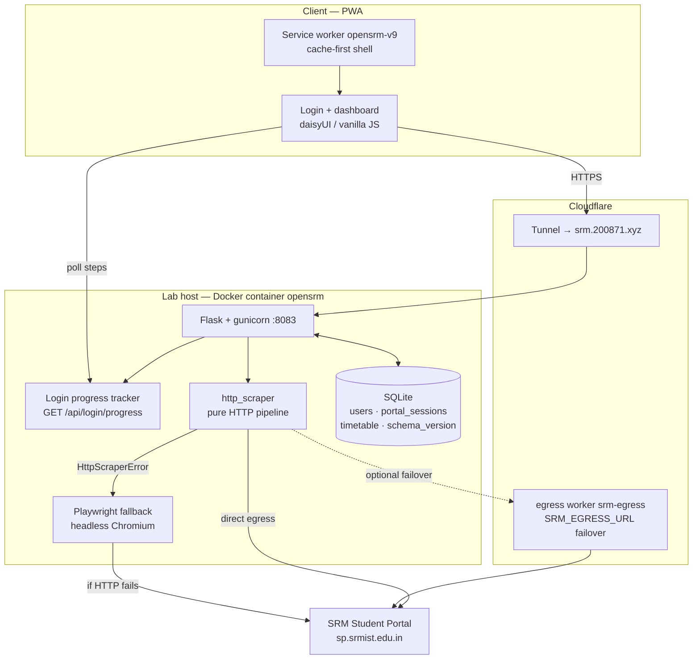
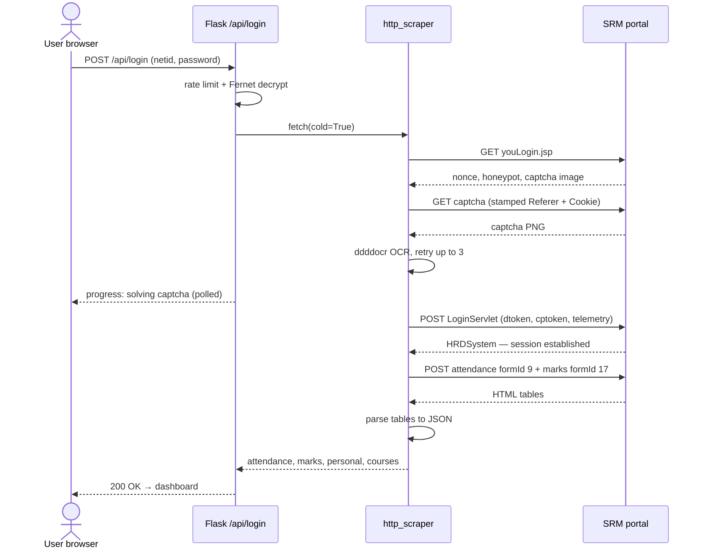
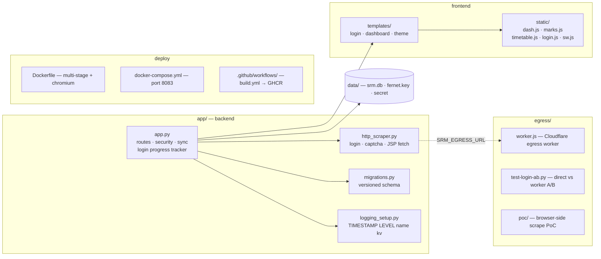

<p align="center">
  
</p>

# OpenSRM

A self-hosted attendance dashboard for the SRM Student Portal, built as a progressive web app.

**Live instance:** [srm.200871.xyz](https://srm.200871.xyz)

**Install as an app:** Android Chrome → "Add to Home Screen". iOS Safari → Share → Add to Home Screen.

---

## What it does

- **Login** — authenticates against the SRM portal via a pure-HTTP pipeline (Playwright fallback); accepts netid or email; captcha auto-retry (up to 3 attempts); live step-by-step progress while logging in
- **Attendance** — course-wise, monthly, and daily absent details with live percentages; bunk calculator
- **Internal Marks** — CT/FT/attendance component-wise marks per subject, with color-coded status badges
- **Timetable** — per-group schedule from SQLite; current/next class status; drag-and-drop editor with subject palette
- **Personal Details** — student info grouped into sections (Academic, Personal, Family, Contact)
- **Hot/cold data** — attendance + marks refreshed on every sync; personal details/timetable reused until stale (24h)
- **PWA** — installable on Android, iOS, Windows; offline shell with cached last-view

---

## Quick start

```bash
# Production (Docker)
git clone https://github.com/thenabbu/OpenSRM.git
cd OpenSRM
docker compose up -d
# Access at http://localhost:8083

# Development (venv)
uv venv .venv && source .venv/bin/activate
uv sync --frozen
playwright install chromium
DATA_DIR=./data gunicorn -w 1 --threads 8 -b 0.0.0.0:8084 app.app:app
# Access at http://localhost:8084
```

---

## Tech stack

| Layer | Technology |
|-------|------------|
| Backend | Flask 3.0, Python 3.11, gunicorn (gthread) |
| Scraping | Pure HTTP (urllib) against the portal; Playwright (headless Chromium) fallback |
| Captcha | ddddocr (self-contained OCR) |
| Database | SQLite with versioned migration system |
| Frontend | Tailwind CSS + daisyUI (CDN), vanilla JS, Jinja2 |
| PWA | Service worker (network-first dashboard, cache-first static) |
| CI/CD | GitHub Actions → GHCR |
| Deployment | Docker on lab, Cloudflare Tunnel for HTTPS |

---

## Architecture



---

## How it works

1. **Login** — `http_scraper` fetches the login page (nonce, honeypot, captcha), solves the captcha via ddddocr (up to 3 retries), then POSTs `LoginServlet` with the portal's anti-bot tokens
2. **Progress** — each step publishes to an in-memory tracker; the login screen polls `/api/login/progress` and shows the user what is happening
3. **Hot data** — attendance (`funSetFormId(9)`) and internal marks (`funSetFormId(17)`) fetched on every sync
4. **Cold data** — personal details re-fetched only when older than 24h; timetable rendered from SQLite
5. **Store** — parsed JSON written to SQLite; on pipeline failure the login falls back to Playwright



---

## Project structure



---

## Configuration

| Setting | Default | Description |
|---------|---------|-------------|
| Port | 8083 | Web interface port |
| Rate limit (netid) | 3 per 10 min | Scrapes per account |
| Rate limit (IP) | 10 per hour | Login attempts per IP |
| Session | 30 days | Cookie lifetime |

Environment variables:
- `DATA_DIR` — SQLite data directory (default: `/app/data`)
- `CHROMIUM_PATH` — Chromium executable path
- `LOG_LEVEL` — Logging verbosity: DEBUG, INFO (default), WARNING, ERROR
- `TZ` — Timezone (default: `Asia/Kolkata`)

---

## Security

- Fernet-encrypted passwords at rest
- HTTP-only session cookies with Secure flag (behind HTTPS)
- CSP headers (script-src 'self', no external scripts)
- Rate limiting per netid and per IP
- Cloudflare Tunnel for HTTPS termination

See [SECURITY.md](SECURITY.md) for details.

---

## Contributing

See [CONTRIBUTING.md](CONTRIBUTING.md).

## License

MIT — do whatever, no warranty. Not affiliated with SRM Institute.
