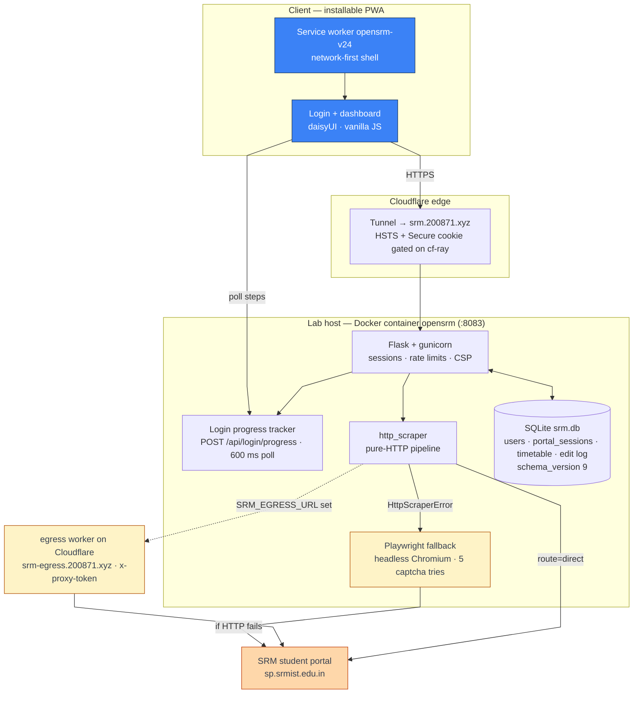
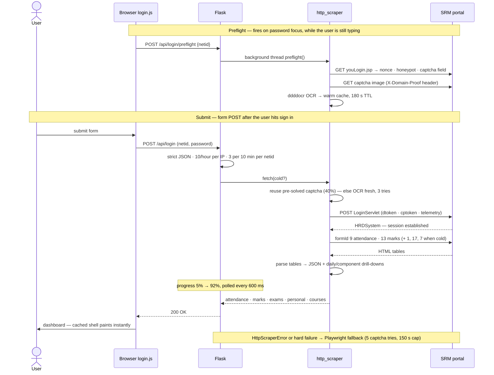
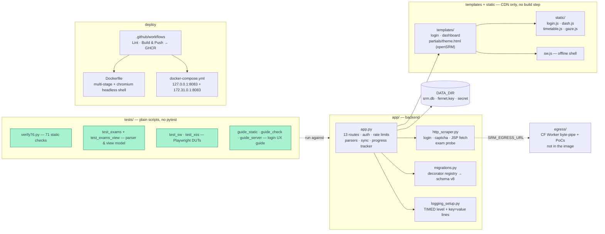

<p align="center">
  
</p>

# OpenSRM

A self-hosted attendance dashboard for the SRM Student Portal, built as a progressive web app.

**Live instance:** [srm.200871.xyz](https://srm.200871.xyz)

**Install as an app:** Android Chrome → "Add to Home Screen". iOS Safari → Share → Add to Home Screen.

---

## What it does

- **Reliability** — a corrupt stored row degrades with a logged warning instead of a 500 on every load; a mid-scrape relogin re-reads the fresh portal page instead of the dead session's body; stored marks/subjects survive a failed or empty fetch (preserve-if-empty, like attendance/personal/exams); unhandled errors land in one greppable ERROR line with a traceback
- **Login** — authenticates against the SRM portal via a pure-HTTP pipeline (Playwright fallback); accepts netid or email; captcha auto-retry (up to 3 attempts in the HTTP pipeline, 5 via the fallback); live step-by-step progress bar while logging in; **preflight** — the login page warms the portal session and solves the captcha while you're still typing your password; guide-compliant form with floating labels, show/hide toggle, and a Caps-Lock hint that reserves its own row (zero layout shift); rejections are classified on the portal's own alert text, so a wrong password says "invalid credentials" on the first attempt instead of burning 3 captcha retries (and the portal's 3-attempts-per-NetID lockout), and every sync lockout names its real remaining time
- **Sessions** — concurrent per account (phone, laptop, PWA each hold their own 30-day cookie); logging in on one device never evicts the others, `/logout` ignores Cloudflare speculation prefetches so a hover-adjacent touch can't silently kill the session, and real logout/expiry events are one auth-log line each
- **Attendance** — meter rows per subject (§4.15): exact fill vs a white 75% tick, pinned numbers (attended / 75%-value / total), and the bare must-attend-or-can-skip count on a connector line; semester skip budgets (90-working-day and day-before-first-endsem models) in a quiet Estimates card; absences as `date · hours` chips merged with the monthly breakdown (one block per month, bar + chips together); no aggregate anywhere. Timetable rows carry a text glance signal (can skip N / attend N; neutral "no data" for unmatched or custom slots) and the today hero shows the current class's skip stat
- **Internal Marks** — component-wise marks per subject (name + entered date + score), neutral numbers with a single muted outlier accent, IE-1/IE-2 roles derived from component maxima and confirmable per class (persisted for GPA prediction); glance widget on the dashboard
- **End-sem exams** — official schedule from the portal's **Exam Time Table** page (`iden=126`, live since Oct 2026 — the only source with exact clock slots), merged per subject with the legacy `ScribeInner.jsp` leak (`iden=1` + any month/year — the portal doesn't validate against its own dropdown) as the **pre-release fallback**: official rows win per code, scribe rows fill subjects the official page leaves pending. Stamped-date dashboard card (day + weekday + countdown, source badge `Official` / `Official + est.` / `Estimated` derived from clock slots; room allotments from the same table render as `Hall … · Seat …` in the row meta). One-shot Web Push events fire on the estimate→official transition ("official timetable released") and on hall/seat publication or change (~1 day before each exam); card hides itself if no session is seeded or the portal closes the gap — and a portal response that lists subjects *without* dates (seen Oct 2026) never wipes the stored schedule
- **Mid-sem feedback** — harvests the portal's Mid Sem Feedback form during any cold sync while the window is open into the subject→teacher map (the portal's only subject→teacher source — course lists carry no faculty), rendered as a dashboard "Teachers" card. **Filling is opt-in**: an *Auto-fill mid-sem feedback* button under the card opens an explainer modal — how it works (every teacher gets their own form — one portal form per teacher within a subject — 5 = EXCELLENT on all 14 questions, comment "none", live re-verify) plus the exact per-teacher list — and the modal's *Fill feedback* confirm button is the only path that writes to the portal (the sync itself is read-only, paced ~0.7s/request). The endpoint rebuilds the plan server-side from the stored map (same builder as the preview), re-verifies each subject live (already-filled / teacher-changed / window-closed all report honestly), and a closed window or changed portal markup aborts without touching attendance/marks; the stored map is only overwritten by a fresh successful harvest.
- **Timetable** — per-group schedule from SQLite; current/next class status; break/lunch shown as dividers, not period blocks (and only *between* classes — no stray break after the day's last one); drag-and-drop editor with subject palette; **section-visible edit history** — every save logs who changed which slot and when, so fixes and vandalism are both on the record (bulk saves collapse to 3 lines + a `+N more` toggle)
- **Personal Details** — identity header (name + program) over collapse groups (Academic, Personal, Family, Contact) with present-field count badges; dense 2-column label-above-value grid with all groups open on desktop, first group only on mobile; click any value to copy it
- **Hot/cold data** — attendance + marks refreshed and persisted on every sync; personal details/courses reused until stale (24h); timetable served from SQLite and only changes when you edit it; opening the page shows cached data instantly with a quiet background re-sync
- **Telemetry** — usage events (page views, logins, syncs) counted per netid in the app's own SQLite, same database as everything else; no third-party scripts, no cookies
- **PWA** — installable on Android, iOS, Windows; offline shell with cached last-view (network-first so deploys never serve stale JS)
- **Class reminders** — Web Push notification a few minutes before each class (subject, start time, room when set), delivered even with the app closed; opt-in per device with 5/10/15/30-minute lead, a test button with server-side delivery receipts, and iOS Home-Screen guidance — driven by an external every-minute tick ([docs/push.md](docs/push.md))

---

## Quick start

```bash
# Production (Docker)
git clone https://github.com/thenabbu/OpenSRM.git
cd OpenSRM
docker compose up -d
# Access at http://localhost:8083  (bound to loopback + the cloudflared gateway, not 0.0.0.0)

# Development (venv)
uv venv .venv && source .venv/bin/activate
uv sync --frozen
playwright install chromium
DATA_DIR=./data gunicorn -w 1 --threads 8 -t 120 --worker-class gthread -b 0.0.0.0:8084 app.app:app
# Access at http://localhost:8084
```

---

## Tech stack

| Layer | Technology |
|-------|------------|
| Backend | Flask 3.1, Python 3.11, gunicorn (gthread, single worker) |
| Scraping | Pure HTTP (urllib) against the portal; Playwright (headless Chromium) fallback |
| Captcha | ddddocr (self-contained OCR) |
| Database | SQLite with a versioned migration registry (7 migrations → schema v8) |
| Frontend | Tailwind CSS 4.3.3 + daisyUI 5.7.46 (pinned CDN, no build step), vanilla JS, Jinja2 |
| PWA | Service worker (network-first for HTML and static, cache as offline fallback) |
| CI/CD | GitHub Actions → `ghcr.io/thenabbu/opensrm:latest` |
| Deployment | Docker on lab, Cloudflare Tunnel for HTTPS |

---

## Architecture


```mermaid
%%{init: {"flowchart": {"curve": "linear"}}}%%
flowchart TD
    subgraph client["Client — installable PWA"]
        UI["Login + dashboard<br/>daisyUI · vanilla JS"]
        SW["Service worker opensrm-v24<br/>network-first shell"]
    end

    subgraph edge["Cloudflare edge"]
        TUN["Tunnel → srm.200871.xyz<br/>HSTS + Secure cookie gated on cf-ray"]
    end

    subgraph lab["Lab host — Docker container opensrm (:8083)"]
        FL["Flask + gunicorn<br/>sessions · rate limits · CSP"]
        PROG["Login progress tracker<br/>POST /api/login/progress · 600 ms poll"]
        HS["http_scraper<br/>pure-HTTP pipeline"]
        PW["Playwright fallback<br/>headless Chromium · 5 captcha tries"]
        DB[("SQLite srm.db<br/>users · portal_sessions · timetable · edit log<br/>schema_version 9")]
        FL --> PROG
        FL <--> DB
        FL --> HS
        HS -->|"HttpScraperError"| PW
    end

    EG["egress worker on Cloudflare<br/>srm-egress.200871.xyz · x-proxy-token"]
    P["SRM student portal<br/>sp.srmist.edu.in"]

    UI -->|"HTTPS"| TUN
    TUN --> FL
    SW --> UI
    UI -->|"poll steps"| PROG
    HS -->|"route=direct"| P
    HS -.->|"SRM_EGRESS_URL set"| EG
    EG --> P
    PW -->|"if HTTP fails"| P

    classDef client fill:#3b82f6,stroke:#1e3a5f,color:#ffffff
    classDef conditional fill:#fef3c7,stroke:#b45309,color:#374151
    classDef external fill:#fed7aa,stroke:#c2410c,color:#374151
    class UI,SW client
    class PW,EG conditional
    class P external
```

---

## How it works

1. **Preflight** — the login page fires `POST /api/login/preflight` on password focus: the server fetches `youLogin.jsp` (nonce, honeypot, captcha field), fetches the captcha image with an `X-Domain-Proof` header, solves it via ddddocr, and keeps it warm for 150 s — all while the user is still typing
2. **Login** — `http_scraper` POSTs `LoginServlet` with the portal's anti-bot tokens (`dtoken`, `cptoken`, telemetry payload), retrying the captcha up to 3 times; progress steps (5% → 92%) are published to an in-memory tracker that the login screen polls every 600 ms
3. **Hot data** — attendance (`funSetFormId(9)`), internal marks (`funSetFormId(13)`, plus per-subject component drilldown), and the official Exam Time Table (`funSetFormId(126)`) fetched on every sync and persisted
4. **Cold data** — profile/personal details/subject lists (`funSetFormId(1), 17, 7`) re-fetched only when older than 24h; timetable rendered from SQLite
5. **Exams** — the official Exam Time Table (`iden=126`) rides the same fetch batch as a hot formId; the `ScribeInner.jsp` leak probe (Apr–Jun, Nov–Dec candidate windows) still runs alongside as the pre-release fallback, and the rows are parsed into the dashboard card
6. **Store** — parsed JSON written to SQLite; if the HTTP pipeline dies (`HttpScraperError`), the login falls back to Playwright (5 captcha retries, 150 s hard cap)


```mermaid
sequenceDiagram
    actor U as User
    participant B as Browser login.js
    participant F as Flask
    participant S as http_scraper
    participant P as SRM portal

    Note over B,P: Preflight — fires on password focus, while the user is still typing
    B->>F: POST /api/login/preflight {netid}
    F->>S: background thread preflight()
    S->>P: GET youLogin.jsp → nonce · honeypot · captcha field
    S->>P: GET captcha image (X-Domain-Proof header)
    S->>S: ddddocr OCR → warm cache, 180 s TTL

    Note over U,P: Submit — form POST after the user hits sign in
    U->>B: submit form
    B->>F: POST /api/login (netid, password)
    F->>F: strict JSON · 10/hour per IP · 3 per 10 min per netid
    F->>S: fetch(cold?)
    S->>S: reuse pre-solved captcha (40%) — else OCR fresh, 3 tries
    S->>P: POST LoginServlet (dtoken · cptoken · telemetry)
    P-->>S: HRDSystem — session established
    S->>P: formId 9 attendance · 13 marks (+ 1, 17, 7 when cold)
    P-->>S: HTML tables
    S->>S: parse tables → JSON + daily/component drill-downs
    Note over F: progress 5% → 92%, polled every 600 ms
    S-->>F: attendance · marks · exams · personal · courses
    F-->>B: 200 OK
    B->>U: dashboard — cached shell paints instantly

    Note over F,P: HttpScraperError or hard failure → Playwright fallback (5 captcha tries, 150 s cap)
```

---

## Project structure


```mermaid
flowchart LR
    subgraph backend["app/ — backend"]
        APP["app.py<br/>13 routes · auth · rate limits<br/>parsers · sync · progress tracker"]
        SCR["http_scraper.py<br/>login · captcha · JSP fetch<br/>exam probe"]
        MIG["migrations.py<br/>decorator registry → schema v8"]
        LOG["logging_setup.py<br/>TIMED level + key=value lines"]
    end

    subgraph frontend["templates + static — CDN only, no build step"]
        TPL["templates/<br/>login · dashboard<br/>partials/theme.html (openSRM)"]
        JS["static/<br/>login.js · dash.js<br/>timetable.js · gaze.js"]
        SWJS["sw.js — offline shell"]
    end

    subgraph gate["tests/ — plain scripts, no pytest"]
        T1["verify76.py — 71 static checks"]
        T2["test_exams + test_exams_view — parser & view model"]
        T3["test_sw · test_xss — Playwright DUTs"]
        T4["guide_static · guide_check · guide_server — login UX guide"]
    end

    subgraph ship["deploy"]
        DF["Dockerfile<br/>multi-stage + chromium headless shell"]
        DC["docker-compose.yml<br/>127.0.0.1:8083 + 172.31.0.1:8083"]
        CI[".github/workflows<br/>Lint · Build & Push → GHCR"]
    end

    EGDIR["egress/<br/>CF Worker byte-pipe + PoCs<br/>not in the image"]
    DATA[("DATA_DIR<br/>srm.db · fernet.key · secret")]

    APP --> SCR
    APP --> MIG
    APP --> LOG
    APP --> TPL
    TPL --> JS
    TPL --> SWJS
    APP --> DATA
    SCR -.->|"SRM_EGRESS_URL"| EGDIR
    CI --> DF
    CI --> DC
    gate -.->|"run against"| backend

    classDef gatecls fill:#a7f3d0,stroke:#047857,color:#374151
    class T1,T2,T3,T4 gatecls
```

---

## Configuration

| Setting | Default | Description |
|---------|---------|-------------|
| Port | 8083 | Web interface port (compose maps loopback + cloudflared gateway → container 8080) |
| Rate limit (netid) | 3 per 10 min | Scrapes per account — counted only once the sync actually runs (a busy/cooldown/budget rejection costs nothing) |
| Rate limit (IP) | 10 per hour | Login attempts per IP |
| Portal budget | 30 per 10 min | Aggregate server→portal requests |
| Portal cooldown | 5 → 30 min | After 3 consecutive portal failures: 5 min, doubling, capped at 30 |
| Session | 30 days | Cookie lifetime |

Environment variables:
- `DATA_DIR` — SQLite data directory (default: `/app/data`; holds `srm.db`, `fernet.key`, `secret`)
- `CHROMIUM_PATH` — Chromium executable path (Playwright fallback)
- `LOG_LEVEL` — Logging verbosity: DEBUG, INFO (default), WARNING, ERROR
- `TZ` — Timezone (default: `Asia/Kolkata`)
- `SRM_EGRESS_URL` + `SRM_PROXY_TOKEN` — optional: route portal traffic through the Cloudflare egress worker instead of direct egress (both must be set, otherwise direct)
- `PUSH_ENABLED` (default off) / `PUSH_DRY_RUN` / `PUSH_ALLOW_NETIDS` — class-reminder rollout controls (see [docs/push.md](docs/push.md))
- `PUSH_TICK_SECRET` — secret header for `POST /internal/push/tick` (cron-job.org); unset → 401
- `VAPID_PUBLIC_KEY` / `VAPID_PRIVATE_KEY` / `VAPID_SUBJECT` — Web Push keys (env-only, generated once by `scripts/generate_push_keys.py`); missing → feature reports "not configured"
- `NTFY_ALERT_URL` — optional: an [ntfy](https://ntfy.sh) topic URL; when set, ERROR-level faults (5xx/unhandled — never routine 4xx) POST there with their kv cause (rate-limited to 1/min, a failed send re-arms after 10s) so no real failure goes unseen

---

## Security

- Fernet-encrypted passwords at rest; `srm_session` cookie is HttpOnly + SameSite=Lax, Secure flag gated on a real `cf-ray` + HTTPS hop
- CSP headers (script-src 'self' + cdn.jsdelivr.net for the pinned Tailwind/daisyUI CDN — no inline scripts)
- Rate limiting per netid, per IP, plus an aggregate portal budget and escalating portal cooldown
- Strict JSON request bodies (no form-encoded login), 16 KB body cap, parameterized SQL
- Cloudflare Tunnel for HTTPS termination; HSTS only served on `cf-ray` responses

See [SECURITY.md](SECURITY.md) for details.

---

## Documentation

- [AGENTS.md](AGENTS.md) — quickstart for agents: dev loop, test matrix, release rules, gotchas
- [DESIGN.md](DESIGN.md) — the `openSRM` daisyUI theme: tokens, components, house rules
- [CONTRIBUTING.md](CONTRIBUTING.md) — setup, PR flow, portal rate limits
- [docs/push.md](docs/push.md) — Web Push class reminders: architecture, env vars, cron-job.org job, rollout, limitations
- [docs/audit/](docs/audit/) — consolidated audit record (76 findings, all fixed)

---

## Contributing

See [CONTRIBUTING.md](CONTRIBUTING.md).

## License

MIT — do whatever, no warranty. Not affiliated with SRM Institute.
